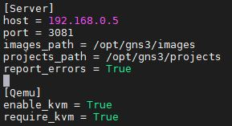
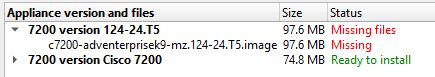
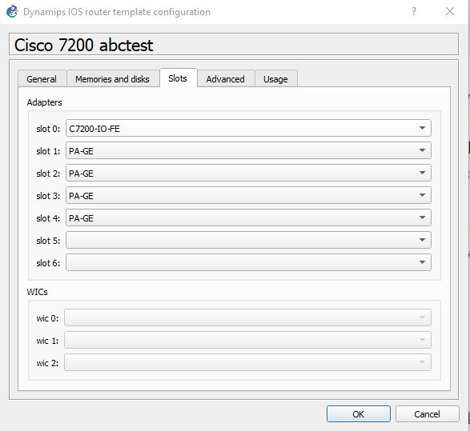
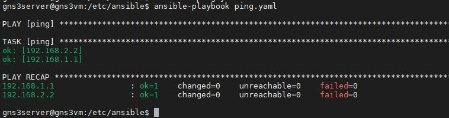

# IN730 Special Topic - Network Automation
<br>

## Lab1 - Setting up Ansible (Cloud Version)

# Azure

## Disclaimer

vim is the text editor used in the following lab guide but you can use your own preferred text editor if you wish *SOMETHING ABOUT HAVING TO KNOW IT YOURSELF*

Ansible / gns3server are the same *REWORD*

## Requirements
- Azure Subscription 

## Topology


## SIGNUP SECTION TO BE ADD

Azure portal https://portal.azure.com/ and sign in

## Resource Group

Create a resource group to store the project *REWORD* in

type "resource groups" in the search bar and click on the resource groups under services

now click add to make a new resource group

here you can name the resource group 
lets call it "ansible" for now

you can also select the region you want your resource group in, unless you require it to be in a specific region in order to do things it is instead best to choose a region that is the closest to you
lets select australia east from the drop down

now lets create our resource group
click the review + create and confirm the creation

## Network

we now need to create a virtual network that will be used *REWORD*

go to your ansible resource group and click the add button

go to the networking tab and select virtual network

Set the name for your virtual network to ansible<br>
Set the region for your virtual network to Australia East
```
Name - ansible
Region - Australia East
```
create ipv4 address space for your virutal network

we will make it a 192.168.0.0/16
```
ipv4 address space
192.168.0.0/16
```
we will now subnet our address range<br>
we will name this subnet ansible<br>
we will give this subnet an address range of 192.168.0.0/24
```
add subnet
name - ansible
subnet 192.168.0.0/24
```

Click the review + create and double check that it is all correct

If everything is correct click the create button
```
review + create
create
```
## VM 1 - Windows

type "resource groups" in the search bar and click on the resource groups under services

click on the ansible resource group that you created

click on the add button

this will take you to a page where you can choose from a large range of options of things to add to your resource group but for now we only need a virtual machine

on the left hand side select the compute option now select virtual machine, this will take you to a screen where you can create a virtual machine

because the free trial has a maximum amount of vcpus that you can have allocated per region we need to make sure we divided them correctly between the ansible/gns3 server and the gns3client machine

confirm that the resource group is ansible
```
details
Virtual machine name - gns3client
Region - (Asia Pacific) Australia East
Image - Windows 10 Pro
Azure Spot Instance - default
Size - Standard_B2s
Username - gns3client
Password - gns3clientP@ssw0rd
Confirm Password - gns3clientP@ssw0rd
Public inbound ports - default
Select inbound ports - default
Licensing - check
```
```
disks
Leave as default
```
```
Networking
Virtual network - Ansible
subnet - Ansible (192.168.0.0/24)
public ip - default
NIC network security group - none
Load balancing - default
```
```
Management
leave as defaults
```
```
Advanced
leave as defaults
```
```
Tags
leave as defaults
```
```
review + create
check over and make sure you have the correct options set
```
* DNS PART TBA

## VM 2 - Ansible

type "resource groups" in the search bar and click on the resource groups under services

```
Virtual machine name - gns3server
Resource Group - ansible
Region - (Asia Pacific) Australia East
Image - Ubuntu Server 18.04 LTS
Azure Spot Instance - default
Size - Standard_E2s_v3
Authentication type - Password
Username - gns3server
Password - gns3server@ssw0rd
Confirm Password - gns3server@ssw0rd
Public inbound ports - default
Select inbound ports - default
```
```
Disks
leave as defaults
```
```
Networking
Virtual network - Ansible
subnet - Ansible (192.168.0.0/24)
public ip - default
NIC network security group - none
Load balancing - default
```
```
Management
leave as defaults
```
```
Advanced
leave as defaults
```
```
Tags
leave as defaults
```
```
review + create
check over and make sure you have the correct options set
```
* DNS PART TBA

We will configre a dns on our gns3server so that connecting to it is easier *REWORD*

go to your Ansible resource group and click on your gns3server-ip


From here click the configuration option on the left hand side of the screen under settings 


under "DNS name label (optional)" 

lets set our DNS name label to
```
gns3server
```

and save it

your DNS name label will be suffixed with ".australiaeast.cloudapp.azure.com" i.e. gns3server.australiaeast.cloudapp.azure.com

* If there are multiple people working on this you may need to tweak your name by appending a number onto the end i.e. gns3server1 etc. if you had to do this note the change for future steps

Alternatively you could also instead configure a static ip and use that in place of a DNS

## gns3server

The following occurs on our gns3server VM

Before we start lets make sure that we can download the latest software *REWORD*

In order to do this run the following command
```
sudo apt-get update -y
```
<br>
First thing we need to do is install gns3 server onto our linux server so that our gns3 client can connect to it

run the following commands to install the gns3 server
```
cd /tmp
curl https://raw.githubusercontent.com/GNS3/gns3-server/master/scripts/remote-install.sh > gns3-remote-install.sh
sudo bash gns3-remote-install.sh --with-openvpn --with-iou --with-i386-repository
```

Its now time to edit our server settings so that we can connect to it using the gns3client virtual machine

Run the following command

```
ip a
```

and note the ip address of eth0, we will use this in our gns3_server.conf file

Now lets edit our gns3_server.conf file

```
sudo vim /etc/gns3/gns3_server.conf
```

make sure that the "host = " is set to the ip of eth0<br>
and that the port = variable to 3081

Your gns3_server.conf file should look like the one in the image below



After making these changes we now need to restart gns3<br> 
use the following command
```
sudo systemctl restart gns3.service
```


Now we will create a tap interface so that we can connect our virtual network that we will create in gns3 to our physical network so that it can communicate with outside devices

First we will need to download uml-utilities which will allow us to create TAP interfaces
```
sudo apt-get install uml-utilities -y
```

Now that we have uml-utilties we can go ahead and create a TAP interface
* Do note that the TAP interface and the ip associated with it are not persistant doing it the following way so you will have to run the following commands each time you shutdown or restart your VM
```
sudo tunctl -t tap1
sudo ifconfig tap1 192.168.1.254 netmask 255.255.255.0 up
```

to allow connection to the outside we need to configure some iptable rules
```
sudo iptables -t nat -A POSTROUTING -o eth0 -j MASQUERADE
sudo iptables -A FORWARD -i tap1 -j ACCEPT
sudo iptables -A INPUT -i tap1 -j ACCEPT
sudo iptables -A FORWARD -i eth0 -j ACCEPT
sudo iptables -A INPUT -i eth0 -j ACCEPT
```

Create routes<br>
we need to create routes<br>
so that traffic<br>
*SOMETHING*
```
sudo ip route add 192.168.1.0/24 via 192.168.1.254 dev tap1
sudo ip route add 192.168.2.0/30 via 192.168.1.254 dev tap1
```

## Install GNS3 Client

## <p style="text-align: center;">The following occurs on our gns3client VM

Step X) GNS3 Setup

X) Sign up to gns3 https://www.gns3.com/ then proceed to download the windows version of gns3 https://www.gns3.com/software/download

GNS3 INSTALL STEPS HERE

Edit > preferences > server

change the host to gns3server.australiaeast.cloudapp.azure.com<br>
port 3081


leave auth unchecked

## Router Template Configuration

Because gns3 doesn't come with any routers avaliable to use by default we need to import and configure a template for one

First we will need to download the image for our cisco 7200 here is a link to the image download
```
https://github.com/samsojl1/Otago-Polytechnic/raw/master/Special-Topic/c7200/c7200-advipservicesk9-mz.122-33.SRC2.extracted.bin
```

Now lets import the cisco 7200 into gns3
1) File 
2) New template
3) Install an appliance from the GNS3 server 
4) Next 
5) Click the dropdown for the routers section and select cisco 7200
6) Click install 
7) Install the appliance on the main server 
8) Create a new version
9) Version name "Cisco 7200"<br>
 
10) select your version from the list 
 
11) Click import, locate and select the cisco 7200 bin file your downloaded earlier, your version should change from "Missing" to "Ready to install" as shown in the images
 
12) Click next
13) Accept the install 
14) Finish

If you click on the router icon on the left hand side<br>
  
you should now see your router template you installed<br>
  

Now we need to configure our newly created router to do this right click on the newly created router and click on the configure template option



From here go to the Slots tab and add "PA-GE" to Adapters slots 1 through 4 this will add 4 gigabyte interfaces to your routers when you spawn them

## Basic GNS3 Network

## Topology

The following network topology is what we will use to create our basic network in gns3


Lets create a simple network in GNS3 and connect it to our physical connect via a tap interface

In order to do this first we must create a new blank project and name it *SOMETHING*

The code to configure the gns3 network environment has been provided below<br>
The commands have also been provided in a way that they will work no matter where your are located cli wise *REWORD*

1) Add 2 of our newly created cisco 7200 routers
2) Cable these 2 routers together
3) Configure these 2 routers with ip addresses according to the topology provided

On R1
```
end
conf t
int g2/0
ip address 192.168.2.1 255.255.255.252
no shut
```
On R2

```
end
conf t
int g2/0
ip address 192.168.2.2 255.255.255.252
no shut
```
4) Verify that R1 can ping R2 and vice versa
On R1
```
end
ping 192.168.2.2
```
On R2
```
end
ping 192.168.2.1
```
5) Add a cloud to our network, you can find this by clicking on the end device icon<br>
<br>

6) Select the cloud
7) Go to the "TAP Interfaces" tab
8) Check the that tap1 has been added

9) Cable R1 to the cloud using the tap1 interface
10) Configure R1 with an ip address

On R1 
```
end
conf t
int g1/0
ip address 192.168.1.1 255.255.255.0
no shut
```
11) confirm that R1 can ping the tap interface
```
end
ping 192.168.1.254
```
12) Confirm that the gns3server can ping R1
* you will need to do this on the gns3server

we now need to Configure OSPF and a static default route then redistirbute that route into ospf, this will allow R2 to send traffic to the gns3server and outwards *REWORD*

13) Configure OSPF

On R1
```
end
conf t
ip route 0.0.0.0 0.0.0.0 192.168.1.254
router ospf 1
router-id 1.1.1.1
network 192.168.1.0 0.0.0.255 area 0
network 192.168.2.0 0.0.0.3 area 0
default-information originate
```
On R2
```
end
conf t
router ospf 1
router-id 2.2.2.2
network 192.168.2.0 0.0.0.3 area 0
```
14) Confirm that R2 can ping tap1
```
end
ping 192.168.1.254
```
15) Confirm that the gns3server can ping R2
* you will need to do this on the gns3server


Our final step

Because the ansible requires the use of SSH to deploy playbooks, we will need to configure and enable SSH on our routers, a basic ssh configuration has been provided 

On both R1 and R2
``` 
end
conf t
ip domain-name ansible.com
crypto key generate rsa
1024
ip ssh version 2
username admin privilege 15 password 0 admin
line vty 0 4
login local
transport input ssh
exit
```

## Ansible Installation And Setup

## <p style="text-align: center;"> The following occurs on our gns3server VM

All that is left for us to do now is to get ansible setup and then we can run it against our gns3 topology

We now need to download and install ansible onto our server we can achieve this by using the following
```
sudo apt-get install ansible -y
```
Lets go to the ansible directory where the ansible.cfg and hosts file are stored, from this directory you can create and deploy your ansible playbooks as well as modify your host files

```
cd /etc/ansible/
```
We will disable host_key_checking in our ansible configuration file so that we don't need to ssh onto our gns3 routers first before we can deploy playbooks while this does save time it is a security risk, in order to do this we need to open our ansible configuration file in our text editor
```
sudo vim /etc/ansible/ansible.cfg
```
Go to line 62 and uncomment the following
```
#host_key_checking = False
```
Then save the file

Inside the hosts file you can define your network devices and asign them to groups an example is provided inside the file by ansible


In the hosts file you can define your environments in a few different ways you can have have them ungroup or you can put them into groups, having them in groups allows you to deploy your playbooks to a set of devices which can be helpful to make sure they are all configured the same.

In the /etc/ansible/hosts file we will add the ip addresses of the devices we wish to use ansible against
```
[network]
R2 ansible_host=192.168.1.1 ansible_network_os=ios ansible_ssh_user=admin ansible_ssh_pass=admin
R1 ansible_host=192.168.2.2 ansible_network_os=ios ansible_ssh_user=admin ansible_ssh_pass=admin
```
* The [network] defines the name of the group this can be called whatever you wish
* R2 and R1 are the names of the hosts
* ansible_host=X.X.X.X is the ip of the host
* ansible_network_os=ios defines the network platform that the host is using
* ansible_ssh_user=admin the user account that ansible uses to connect with in this example its admin because that is what we created earlier when we setup the router configuration in gns3
* ansible_ssh_pass=admin the password of the user account that ansible is using to connect with

<br>

Let's run an ad-hoc command against the hosts we just added

```
ansible all -c network_cli -m ping
ansible network -c network_cli -m ping
```

lets create a easy playbook to test if everything is working correctly
ansible can be a bit pedantic with its formating so here is a 

```
sudo vim /etc/ansible/ping.yaml
```

and copy and paste the following 
```
---
  - name: ping
    hosts: routers
    connection: local
    gather_facts: false
    tasks:
            - ping:
```

then write quit<br>

Now that we have created our playbook it is time to run in

in order to run your playbook you must be in the directory that it is located or specify the location
In order to run your ansible playbook that you have now created you need to be located in the directory that the playbook was made 

```
ansible-playbook ping.yaml
ansible-playbook /etc/ansible/ping.yaml
```

After running your playbook the following output should occur: <br>


<br>

Congratulations you have now successfully deployed your first ansible playbook

In future labs we will cover more uses for ansible in both a local and cloud environment 

Please save your work or make a script to recreate it quickly along as future labs will be built off this

Further reading:

ansible module list can be found here 
* https://docs.ansible.com/ansible/latest/modules/modules_by_category.html

ansible playbooks user guide can be found here 
* https://docs.ansible.com/ansible/latest/user_guide/playbooks.html


<br>