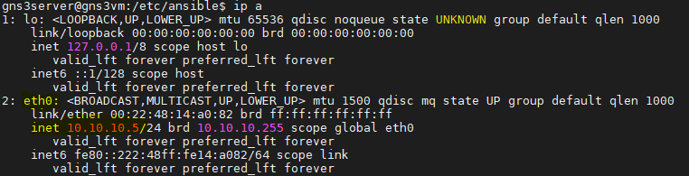
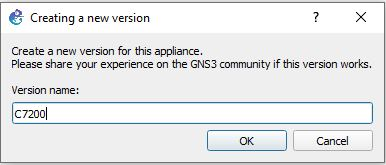
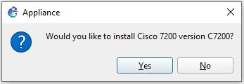
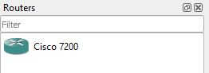
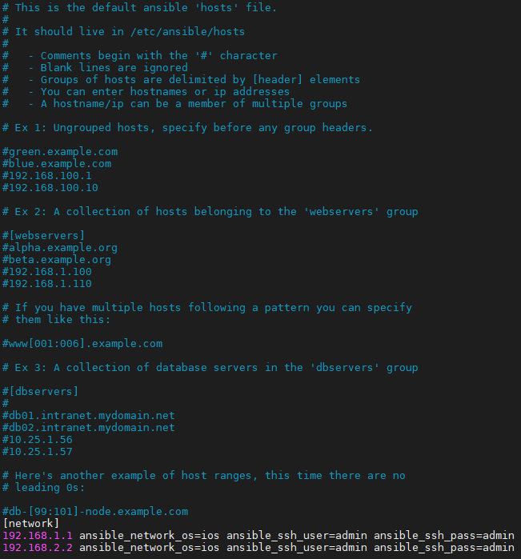

# IN730 Special Topic - Network Automation

## Lab1 - Setting up Ansible (Cloud Version)

## Disclaimer

VIM is the text editor used in the following lab

The GNS3 version used at the creation of this lab was GNS3 2.2.12

## Requirements

- Azure Subscription 
- Terminal Emulator

## Topology


## Azure

Azure portal https://portal.azure.com/ and sign in

Lets go to our azure home https://portal.azure.com/#home

## Resource Group

Let’s create a resource group that we can use for this project

Type "resource groups" in the search bar and click on the resource groups under services


This will take you to your resource group page and display any existing resource groups that you have access to as well as allow you to create new ones

Now click add to make a new resource group


Here you can name the resource group 

Lets call it "ansible" for now


You can also select the region you want your resource group in, unless you require it to be in a specific region in order to do things it is instead best to choose a region that is the closest to you

Lets select Australia East from the drop down

Now lets create our resource group

Click the review + create and confirm the creation

## Network

we now need to create a virtual network that will be used *REWORD*

Go to your ansible resource group and click the add button

Go to the networking tab and select virtual network


Set the name for your virtual network to ansible<br>
Set the region for your virtual network to Australia East
```
Name - ansible
Region - Australia East
```


Go to the IP address tab


Under the ipv4 address we change it from the 10.X.X.X/16 range it gives us to a 192.168.0.0/16


Now we just need to create a subnet within our address range

Click the add subnet button


Name this subnet ansible

Give this subnet an address range of 192.168.0.0/24


Click the review + create and double check that it is all correct

If everything is correct click the create button

## VM 1 - gns3client

We will now create the first of 2 VM's that will be used for this lab

Type "virtual machines" in the search bar and click on the Virtual machines under services


This will take you to your virtual machines page and display any existing virtual machines that you have access to as well as allow you to create new ones

Now click add to make a new virtual machine


Because the free trial has a maximum amount of vcpus that you can have allocated per region we need to make sure we divided them correctly between the ansible/gns3 server and the gns3client machine


## Basics
```
Resource group - ansible
Virtual machine name - gns3client
Region - (Asia Pacific) Australia East
Image - Windows 10 Pro
Azure Spot Instance - default
Size - Standard_B2s
Username - gns3client
Password - gns3clientP@ssw0rd
Confirm Password - gns3clientP@ssw0rd
Public inbound ports - default
Select inbound ports - default
Licensing - check
```
## Disks
```
Leave as default
```
## Networking
```
Virtual network - Ansible
subnet - Ansible (192.168.0.0/24)
public ip - default
NIC network security group - none
Load balancing - default
```
## Management
```
leave as defaults
```
## Advanced
```
leave as defaults
```
## Tags
```
leave as defaults
```
## Review + create
```
check over and make sure you have the correct options set
```

## VM 2 - gns3server / Ansible

We will now create the second of the 2 VM's that will be used for this lab

Type "virtual machines" in the search bar and click on the Virtual machines under services


This will take you to your virtual machines page and display any existing virtual machines that you have access to as well as allow you to create new ones

Now click add to make a new virtual machine


Because the free trial has a maximum amount of vcpus that you can have allocated per region we need to make sure we divided them correctly between the ansible/gns3 server and the gns3client machine


## Basics
```
Virtual machine name - gns3server
Resource Group - ansible
Region - (Asia Pacific) Australia East
Image - Ubuntu Server 18.04 LTS
Azure Spot Instance - default
Size - Standard_E2s_v3
Authentication type - Password
Username - gns3server
Password - gns3server@ssw0rd
Confirm Password - gns3server@ssw0rd
Public inbound ports - default
Select inbound ports - default
```
## Disks
```
Leave as defaults
```
## Networking
```
Virtual network - Ansible
subnet - Ansible (192.168.0.0/24)
public ip - default
NIC network security group - none
Load balancing - default
```
## Management
```
Leave as defaults
```
## Advanced
```
Leave as defaults
```
## Tags
```
Leave as defaults
```
## Review + create
```
Check over and make sure you have the correct options set
```

After creating our gns3server VM we will create and apply a DNS name to it so that it makes connecting to it easier

Go to your Ansible resource group and click on your gns3server VM


Under "DNS name label (optional)" 


Set the DNS name label to

```
gns3server
```

And save it

Your DNS name label will be suffixed with ".australiaeast.cloudapp.azure.com" i.e. gns3server.australiaeast.cloudapp.azure.com

- If there are multiple people working on this you may need to tweak your name by appending a number onto the end i.e. gns3server1 etc. if you had to do this note the change for future steps

Alternatively you could also instead configure a static ip and use that in place of a DNS

## Configure gns3server VM

## <p style="text-align: center;">The following occurs on our gns3server VM

After connecting to our gns3server we need to make sure that we can download the latest software

In order to do this run the following command
```
sudo apt-get update -y
```

Now we need to install the GNS3 server onto our VM so that our GNS3 client can connect to it

Run the following commands to install the GNS3 server
```
cd /tmp
curl https://raw.githubusercontent.com/GNS3/gns3-server/master/scripts/remote-install.sh > gns3-remote-install.sh
sudo bash gns3-remote-install.sh --with-openvpn --with-iou --with-i386-repository
```

Now we need to edit our server settings so that the gns3client can connect

Run the following command

```
ip a
```

and note the ip address of eth0, we will use this in our gns3_server.conf file



Now let’s edit our gns3_server.conf file

```
sudo vim /etc/gns3/gns3_server.conf
```

- Change the "host = " ip to that of your eth0
- Change the "port = " to 3081

Your gns3_server.conf file should look like the one in the image below


After making these changes we now need to restart gns3<br> 
use the following command
```
sudo systemctl restart gns3.service
```

Now we will create a tap interface so that we can connect our virtual network that we will create in gns3 to our physical network so that it can communicate with outside devices

First we will need to download uml-utilities which will allow us to create TAP interfaces
```
sudo apt-get install uml-utilities -y
```

Now that we have uml-utilties we can go ahead and create a TAP interface
* Do note that the TAP interface and the ip associated with it are not persistant doing it the following way so you will have to run the following commands each time you shutdown or restart your VM
```
sudo tunctl -t tap1
sudo ifconfig tap1 192.168.1.254 netmask 255.255.255.0 up
```
To allow connection to the outside we need to configure some iptable rules
```
sudo iptables -t nat -A POSTROUTING -o eth0 -j MASQUERADE
sudo iptables -A FORWARD -i tap1 -j ACCEPT
sudo iptables -A INPUT -i tap1 -j ACCEPT
sudo iptables -A FORWARD -i eth0 -j ACCEPT
sudo iptables -A INPUT -i eth0 -j ACCEPT
```

## Linux Routing

We will need to configure routes so that traffic knows where to go to get to the GNS3 routers

```
sudo ip route add 192.168.1.0/24 via 192.168.1.254 dev tap1
sudo ip route add 192.168.2.0/30 via 192.168.1.254 dev tap1
```

## Install and Setup GNS3

## <p style="text-align: center;">The following occurs on our gns3client VM

In order to download GNS3 you need to signup to their website

- Sign up to GNS3 https://www.gns3.com/ 

- Download the windows version of GNS3 https://www.gns3.com/software/download

After downloading GNS3 onto our windows VM we now need to configure it so that it connects to our GNS3 Server in order to do this we need to start GNS3 

- Go to the Edit tab and select preferences 
- Go to the Server tab

- Change the host to gns3server.australiaeast.cloudapp.azure.com
- Set port 3081


Leave Auth unchecked

## Router Template Configuration

We need to download and configure a router template that we will use within GNS3, GNS3 by default does not come with any routers that you can use.

- Download the image for the cisco 7200 router here 
https://github.com/samsojl1/Otago-Polytechnic/raw/master/Special-Topic/c7200/c7200-advipservicesk9-mz.122-33.SRC2.extracted.bin

In order to create a template using the image we just downloaded we need to do the following

- In GNS3 go to File > New Template

- Install an appliance from the GNS3 server 

- Then click the dropdown for the routers section and select Cisco 7200 then click install 


- Install the appliance on your local computer 

- Select Create a new version

- Name it "C7200" and select ok



- You should now see your router but with its files missing


- select your version from the list and click import, locate and select the c7200-advipservicesk9-mz.122-33.SRC2.extracted.bin image your downloaded

- Next 

- Accept the install
 


- Finish

If you click on the router icon on the left hand side 


<br>

You should now see your router template you installed
<br>


We now need to make a few tweaks to our newly created template

- Right click your router template and select the configure template option


- Go to the "Slots" tab and add "PA-GE" to Adapters slots 1 through 4 this will add  gigabyte interfaces to your routers when you create them

If you click on the router icon on the left-hand side<br>
  
you should now see your router template you installed<br>
  

Now we need to configure our newly created router to do this right click on the newly created router and click on the configure template option


From here go to the Slots tab and add "PA-GE" to Adapters slots 1 through 4 this will add 4 gigabyte interfaces to your routers when you spawn them

## Configure A Basic Network


Let’s create a simple network in GNS3

- Create a new blank project

- Add 2 routers to the project

- Cable these 2 routers together according to the topology above

On R1
```
end
conf t
int g2/0
ip address 192.168.2.1 255.255.255.252
no shut
```
On R2
```
end
conf t
int g2/0
ip address 192.168.2.2 255.255.255.252
no shut
```

Verify that R1 can ping R2 and R2 can ping R1

On R1
```
end
ping 192.168.2.2
```
On R2
```
end
ping 192.168.2.1
```

Now we will add a cloud to our GNS3 project

The cloud allows the routers inside your GNS3 project to communicate with outside devices

Let’s add a cloud to connect our virtual routers to our physical network 

- From the browse end devices tab 


- Add the cloud to your project


After adding the cloud, it is now time to configure it 

- Click on the cloud and go to the "TAP Interfaces" tab
- Check the that tap1 has been added
- Cable R1 to the cloud according to the topology

We will now configure R1's interface that connects with the TAP interface with an ip address 

On R1 
```
end
conf t
int g1/0
ip address 192.168.1.1 255.255.255.0
no shut
```
Confirm that R1 can ping the tap interface
```
end
ping 192.168.1.254
```
Confirm that the gns3server can ping R1

Configure OSPF and a static default route then redistirbute that route into ospf

On R1
```
end
conf t
ip route 0.0.0.0 0.0.0.0 192.168.1.254
router ospf 1
router-id 1.1.1.1
network 192.168.1.0 0.0.0.255 area 0
network 192.168.2.0 0.0.0.3 area 0
default-information originate
```
On R2
```
end
conf t
router ospf 1
router-id 2.2.2.2
network 192.168.2.0 0.0.0.3 area 0
```
Confirm that R2 can ping tap1
```
end
ping 192.168.1.254
```
Confirm that the gns3server can ping R2

Because ansible is agentless and uses SSH to deploy playbooks, you will need to configure and enable SSH onto your GNS3 Routers, a basic configuration has been provided 

``` 
end
conf t
ip domain-name ansible.com
crypto key generate rsa
1024
ip ssh version 2
username admin privilege 15 password 0 admin
line vty 0 4
login local
transport input ssh
exit
```

## Ansible Installation And Setup

## <p style="text-align: center;"> The following occurs on our gns3server VM

All that is left for us to do now is to get ansible setup and then we can run it against our gns3 topology

We now need to download and install ansible onto our server we can achieve this by using the following
```
sudo apt-get install ansible -y
```
Lets go to the ansible directory where the ansible.cfg and hosts file are stored, from this directory you can create and deploy your ansible playbooks as well as modify your host files

```
cd /etc/ansible/
```
We will disable host_key_checking in our ansible configuration file so that we don't need to ssh onto our gns3 routers first before we can deploy playbooks while this does save time it is a security risk, in order to do this we need to open our ansible configuration file in our text editor
```
sudo vim /etc/ansible/ansible.cfg
```
Go to line 62 and uncomment the following
```
#host_key_checking = False
```
Then save the file

Inside the hosts file you can define your network devices and asign them to groups an example is provided inside the file by ansible



In the hosts file you can define your environments in a few different ways you can have have them ungroup or you can put them into groups, having them in groups allows you to deploy your playbooks to a set of devices which can be helpful to make sure they are all configured the same.

In the /etc/ansible/hosts file we will add the ip addresses of the devices we wish to use ansible against
```
[network]
R2 ansible_host=192.168.1.1 ansible_network_os=ios ansible_ssh_user=admin ansible_ssh_pass=admin
R1 ansible_host=192.168.2.2 ansible_network_os=ios ansible_ssh_user=admin ansible_ssh_pass=admin
```
* The [network] defines the name of the group this can be called whatever you wish
* R2 and R1 are the names of the hosts
* ansible_host=X.X.X.X is the ip of the host
* ansible_network_os=ios defines the network platform that the host is using
* ansible_ssh_user=admin the user account that ansible uses to connect with in this example its admin because that is what we created earlier when we setup the router configuration in gns3
* ansible_ssh_pass=admin the password of the user account that ansible is using to connect with

<br>

Let's run an ad-hoc command against the hosts we just added

The following will run the command against any host in our hosts file
```
ansible all -c network_cli -m ping
```
The following will run the command against any host in our network group
```
ansible network -c network_cli -m ping
```
Let’s create a easy playbook to test if everything is working correctly
ansible can be a bit pedantic with its formatting so here is a 

```
sudo vim /etc/ansible/ping.yaml
```

and copy and paste the following 
```
---
  - name: ping
    hosts: routers
    connection: local
    gather_facts: false
    tasks:
            - ping:
```

Now that we have created our playbook it is time to run it

You can run your ansible playbooks by being located in the directory where its located by using
```
ansible-playbook ping.yaml
```
Or you can provide the path to the playbook
```
ansible-playbook /etc/ansible/ping.yaml
```

After running your playbook, the following output should occur


Congratulations you have now successfully deployed your first ansible playbook

In future labs we will cover more uses for ansible in both a local and cloud environment 

Please save your work or make a script to recreate it quickly along as future labs will be built off this

Further reading:

ansible module list can be found here 
- https://docs.ansible.com/ansible/latest/modules/modules_by_category.html

ansible playbooks user guide can be found here 
- https://docs.ansible.com/ansible/latest/user_guide/playbooks.html


