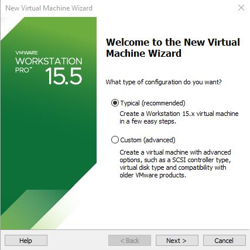

# IN730 Special Topic - Network Automation
<br>

## Lab1 - Setting up Ansible (Local Version)

## Disclaimer

VIM is the text editor used in the following lab

The GNS3 version used at the creation of this lab was GNS3 2.2.12

## Initial Setup
In the following lab we will install and configure the required components needed to **SOMETHING** gns3 and ansible **EXPAND**


## Topology


## Requirements

- VM Workstation 
- Ubuntu VM
- GNS3
- Windows Machine

## Setup


### Ubuntu Setup

First thing we need to do is download a ubuntu image that we will use for our ansible server

- Download Ubuntu 20.04.1 LTS image from here https://ubuntu.com/download/desktop

After downloading the ubuntu image we will now create a virtual machine in VM Workstation

- Launch the VM Workstation Application 
- Go to File
- Select New Virtual Machine 
- Select the "Typical (recommended)" option 



- Select "Installer disc image file (iso):" then locate the Ubuntu iso file you downloaded earlier


- Personalize your ubuntu machine how you wish

- Leave the "Specify Disk Capacity" with the defaults 


- Customize Hardware and change the RAM to 4GB


- Finish


After creating the linux VM we now need to configure some network options in VM workstation

- Click on the Edit tab and go click on the virtual network editior 

- Click on the "Change Settings" option and accept the administrator promopt 


- Select VMnet0 then select Bridged and bridge it to your machines physical network interface


- Also select the VMnet that has the type and external connection of NAT and change its subnet ip to 192.168.0.0 with a subnet mask of 255.255.255.0


In the end your Virtual Network Editor should look simillar to the image below


- connect to your linux VM and open a terminal, then run the command "ip a" and note down the ip address on the ens33(ens number may vary but there will be only one) interface

### GNS3 Setup

In order to download GNS3 you need to signup to their website

- Sign up to GNS3 https://www.gns3.com/ 

- Download the windows version of GNS3 https://www.gns3.com/software/download


### Router Template Configuration

We need to download and configure a router template that we will use, GNS3 does not come with

- Download the image for the cisco 7200 router here 
https://github.com/samsojl1/Otago-Polytechnic/raw/master/Special-Topic/c7200/c7200-advipservicesk9-mz.122-33.SRC2.extracted.bin

- Import the C7200 Router into GNS3 by going file > new template > install an appliance from the GNS3 server > then click the dropdown for the routers section and select Cisco 7200 then click install > Install the appliance on your local computer > create a new version, call it whatever you wish > select your version from the list and click import, locate and select the c7200 bin file your downloaded earlier > next > accept the install > finish, if you click on the router icon on the left hand side you should now see your router template you installed

- right click your newly created router template and click on the configure template option,


from here go to the slots tab and add "PA-GE" to Adapters slots 1 through 4 this will add 4 gigabyte interfaces to your routers when you spawn them

### Configure A Basic Network

Lets create a simple network in GNS3

- create a new blank project and call it whatever you want

- lets add 2 of our newly created routers to the project by going to the router tab and dragging 2 on, cable these 2 routers together and configure them using a private ip 

On R1
```
end
conf t
int g1/0
ip address 192.168.1.1 255.255.255.252
no shut
```
On R2
```
end
conf t
int g1/0
ip address 192.168.1.2 255.255.255.252
no shut
```
- Verify that R1 can ping R2 and vice versa

- lets add a cloud to connect our virtual routers to our physical network 

After adding the cloud click on it and go to "Ethernet Interfaces" tab, then tick the "Show special Ethernet interfaces" box, click the Add all button, this will add all the interfaces from your physical machine to the cloud allowing you to connect your virtual router to it


on the interface you connected your R1 to the cloud you need to configure it with an ip in the same range as the physical interface, the ens** ip you recorded earlier
On R1 
```
end
conf t
int g2/0
ip address 192.168.0.1 255.255.255.0
no shut
```

Configure OSPF and a static default route then redistirbute that route into ospf

On R1
```
end
conf t
ip route 0.0.0.0 0.0.0.0 192.168.0.128
router ospf 1
router-id 1.1.1.1
network 192.168.0.0 0.0.0.255 area 0
network 192.168.1.0 0.0.0.3 area 0
default-information originate
```

On R2
```
end
conf t
router ospf 1
router-id 2.2.2.2
network 192.168.1.0 area 0
```

### Route

On your linux vm you 

### Ansible Setup

- On your Linux VM open a terminal

- run the command sudo apt-get install ansible and accept, this will install ansible onto your linux machine

- cd into /etc/ansible/ this is where the ansible.cfg and hosts file exist from here you can create your playbooks

Inside the hosts file you can define your network devices and asign them to groups an example is provided inside the file by ansible

You can run either use ad-hoc commands or ansible playbooks 

Create a default route and redistribute it into ospf

disable host_key_checking
on line 62 uncomment host_key_checking = False

You should now be able to ping from your linux vm to R2

Because ansible uses SSH to deploy playbooks as well as ad-hoc commands, you will need to enable SSH onto your GNS3 Routers, a basic configuration has been provided 

``` 
end
conf t
ip domain-name ansible.com
crypto key generate rsa
1024
ip ssh version 2
username admin privilege 15 password 0 admin
line vty 0 4
login local
transport input ssh
exit
```

in the hosts file you can define your devices in a few different ways you can have them ungrouped

in the /etc/ansible/hosts file we will add the ip addresses of the devices we wish to use ansible against

```
[routers]
R2 ansible_host=192.168.1.2 ansible_network_os=ios ansible_ssh_user=admin ansible_ssh_pass=admin
R1 ansible_host=192.168.0.129 ansible_network_os=ios ansible_ssh_user=admin ansible_ssh_pass=admin
```
* The [routers] defines the name of the group this can be called whatever you wish
* R2 and R1 are the names of the hosts
* ansible_host=X.X.X.X is the ip of the host
* ansible_network_os=ios defines the network platform that the host is using
* ansible_ssh_user=admin the user account that ansible uses to connect with in this example its admin because that is what we created earlier when we setup the router configuration in gns3
* ansible_ssh_pass=admin the password of the user account that ansible is using to connect with

<br>

lets create a easy playbook to test if everything is working correctly
ansible can be a bit pedantic with its formating so here is a 

```
sudo vim /etc/ansible/test.yaml
```

and copy and paste the following 
```
---
  - name: ping
    hosts: routers
    connection: local
    gather_facts: false
    tasks:
            - ping:
```

then write quit
<br>

In order to run your ansible playbook that you have now created you need to be located in the directory that the playbook was made 

```
ansible-playbook test.yaml
```

After running that command the following output should occur: <br>


<br>

This means that ansible can successfully  *SOMETHING*

ansible all -c network_cli -u samsojl1 -k -m ping -e ansible_network_os=ios

Further reading:

ansible module list can be found here 
* https://docs.ansible.com/ansible/latest/modules/modules_by_category.html

ansible playbooks user guide can be found here 
* https://docs.ansible.com/ansible/latest/user_guide/playbooks.html


## Troubleshooting

If at some point your pings / connection stops working between your linux vm and your 
delete the cable connecting R1 and the cloud together then reconnect