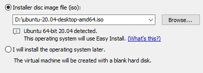
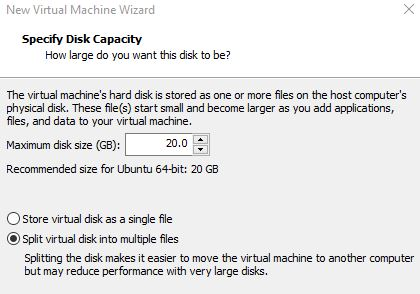
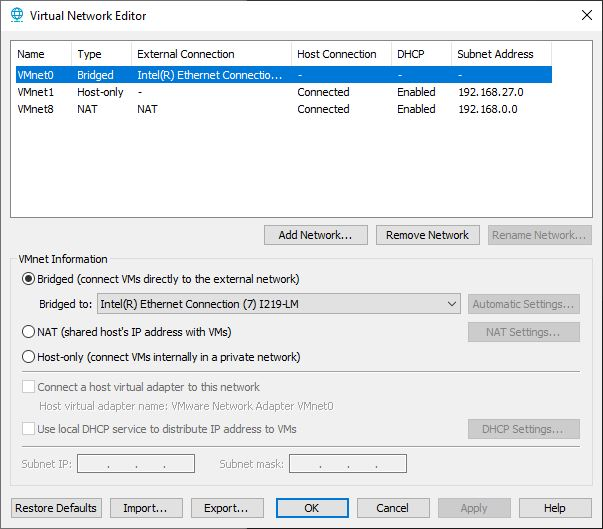

# IN730 Special Topic - Network Automation

## Lab1 - Setting up Ansible (Local Version)

## Disclaimer

VIM is the text editor used in the following lab

The GNS3 version used at the creation of this lab was GNS3 2.2.12


## Topology


## Requirements

- VM Workstation 
- Windows Machine
- Ubuntu 20.04

## Setup


## Ubuntu Setup

First thing we need to do is download a ubuntu image that we will use for our ansible server

- Download Ubuntu 20.04.1 LTS image from here https://ubuntu.com/download/desktop

After downloading the ubuntu image we will now create a virtual machine in VM Workstation

- Launch the VM Workstation Application 
- Go to File
- Select New Virtual Machine 
- Select the "Typical (recommended)" option 


- Select "Installer disc image file (iso):" then locate the Ubuntu iso file you downloaded earlier



- Personalize your ubuntu machine how you wish

- Leave the "Specify Disk Capacity" with the defaults 



- Customize Hardware and change the RAM to 4GB


- Finish


After creating the linux VM we now need to configure some network options in VM workstation

- Click on the Edit tab and go click on the virtual network editior 

- Click on the "Change Settings" option and accept the administrator promopt 


- Select VMnet0 then select Bridged and bridge it to your machines physical network interface


- Also select the VMnet that has the type and external connection of NAT and change its subnet ip to 192.168.0.0 with a subnet mask of 255.255.255.0


In the end your Virtual Network Editor should look simillar to the image below




- Connect to your linux VM and open a terminal

- use the command "ip a" and note down the ip address on the ens33(ens number may vary but there will be only one)


This ip will be used later when we configure GNS3

## GNS3 Setup

In order to download GNS3 you need to signup to their website

- Sign up to GNS3 https://www.gns3.com/ 

- Download the windows version of GNS3 https://www.gns3.com/software/download


## Router Template Configuration

We need to download and configure a router template that we will use within GNS3, GNS3 by default does not come with any routers that you can use.

- Download the image for the cisco 7200 router here 
https://github.com/samsojl1/Otago-Polytechnic/raw/master/Special-Topic/c7200/c7200-advipservicesk9-mz.122-33.SRC2.extracted.bin

In order to create a template using the image we just downloaded we need to do the following

- In GNS3 go to File > New Template

- Install an appliance from the GNS3 server 

- Then click the dropdown for the routers section and select Cisco 7200 then click install 


- Install the appliance on your local computer 

- Select Create a new version

- Name it "C7200" and select ok


- You should now see your router but with its files missing


- select your version from the list and click import, locate and select the c7200-advipservicesk9-mz.122-33.SRC2.extracted.bin image your downloaded

- Next 

- Accept the install
 


- Finish

If you click on the router icon on the left hand side 


<br>

You should now see your router template you installed
<br>


We now need to make a few tweaks to our newly created template

- Right click your router template and select the configure template option


- Go to the "Slots" tab and add "PA-GE" to Adapters slots 1 through 4 this will add  gigabyte interfaces to your routers when you create them

## Configure A Basic Network


Lets create a simple network in GNS3

- Create a new blank project

- Add 2 routers to the project

- Cable these 2 routers together according to the topology above

On R1
```
end
conf t
int g1/0
ip address 192.168.1.1 255.255.255.252
no shut
```
On R2
```
end
conf t
int g1/0
ip address 192.168.1.2 255.255.255.252
no shut
```
Verify that R1 can ping R2 and R2 can ping R1

Now we will add a cloud to our GNS3 project

The cloud allows the routers inside your GNS3 project to communicate with outside devices

Lets add a cloud to connect our virtual routers to our physical network 

- From the browse end devices tab 


- Add the cloud to your project


After adding the cloud we now need to configure it 

- Click on the cloud and go to "Ethernet Interfaces" tab
- Tick the "Show special Ethernet interfaces" option
- Click the Add all button

By selecting the add all option this will add all the interfaces from your physical machine to the cloud allowing you to connect your virtual router to it

- Cable R1 to the Cloud according to the topology 

On the interface you connected your R1 to the cloud you need to configure it with an ip in the same range as the physical interface, the ens33 ip you recorded earlier

On R1 
```
end
conf t
int g2/0
ip address 192.168.0.1 255.255.255.0
no shut
```

Configure OSPF and a static default route then redistirbute that route into ospf

On R1
```
end
conf t
ip route 0.0.0.0 0.0.0.0 192.168.0.128
router ospf 1
router-id 1.1.1.1
network 192.168.0.0 0.0.0.255 area 0
network 192.168.1.0 0.0.0.3 area 0
default-information originate
```

On R2
```
end
conf t
router ospf 1
router-id 2.2.2.2
network 192.168.1.0 area 0
```

Because ansible is agentless and uses SSH to deploy playbooks, you will need to configure and enable SSH onto your GNS3 Routers, a basic configuration has been provided 

``` 
end
conf t
ip domain-name ansible.com
crypto key generate rsa
1024
ip ssh version 2
username admin privilege 15 password 0 admin
line vty 0 4
login local
transport input ssh
exit
```
## Linux Routing

On your linux vm you will need to configure a route so that traffic knows where to go to to get to your GNS3 routers

In your linux terminal use the following command

```
sudo ip route add 192.168.1.0/30 via 192.168.0.128 dev ens33
```

Do note that routes configured this way aren't persistent and will need to be re entered, you can configure them to be persistent but for what we are trying to do that isn't required

## Ansible Setup

Now that everything has been configured so that we can use ansible it is time to setup ansible

On your Linux VM open a terminal and use the command 

```
sudo apt-get install ansible -y
```

This will download and install ansible onto the linux machine

After we have installed ansible we now need to make some configurations to it

Go to the ansible directory
```
cd /etc/ansible/
```

Inside this directory you will find the ansible.cfg and hosts file, this is also where you will create your ansible playbooks to begin with

We will disable host_key_checking in our ansible.cfg file so that we don't need to SSH onto our GNS3 routers first before we can deploy playbooks, while this helps to save time in a lab environment it is also a security risk


```
sudo vim /etc/ansible/ansible.cfg
```
Go to line 62 and uncomment the following
```
#host_key_checking = False
```
Then save the file

Inside the hosts file you can define your network devices and asign them to groups an example of this provided inside the file by ansible

The following is to be added to our hosts file

```
[routers]
R2 ansible_host=192.168.1.2 ansible_network_os=ios ansible_ssh_user=admin ansible_ssh_pass=admin
R1 ansible_host=192.168.0.1 ansible_network_os=ios ansible_ssh_user=admin ansible_ssh_pass=admin
```
- The [routers] defines the name of the group this can be called whatever you wish
- R2 and R1 are the names of the hosts
- ansible_host=X.X.X.X is the ip of the host
- ansible_network_os=ios defines the network platform that the host is using
- ansible_ssh_user=admin the user account that ansible uses to connect with in this example its admin because that is what we created earlier when we setup the router configuration in gns3
- ansible_ssh_pass=admin the password of the user account that ansible is using to connect with

Now that we have everything setup we can finaly use ansible

Lets create a simple playbook to test if everything is working correctly

```
sudo vim /etc/ansible/test.yaml
```

And insert the following
```
---
  - name: ping
    hosts: routers
    connection: local
    gather_facts: false
    tasks:
            - ping:
```

In order to run your ansible playbook that you have now created you need to be located in the directory that the playbook was made 

```
cd /etc/ansible
ansible-playbook test.yaml
```

After running that command the following output should occur <br>


<br>

Congratulations you have now successfully deployed your first ansible playbook

In future labs we will cover more uses for ansible in both a local and cloud environment 

Please save your work or make a script to recreate it quickly along as future labs will be built off this


Further reading:

ansible module list can be found here 
- https://docs.ansible.com/ansible/latest/modules/modules_by_category.html

ansible playbooks user guide can be found here 
- https://docs.ansible.com/ansible/latest/user_guide/playbooks.html

## Troubleshooting

If at some point your pings / connection stops working between your linux vm and your GNS3 routers,
delete the cable connecting R1 and the cloud together then cable them back together