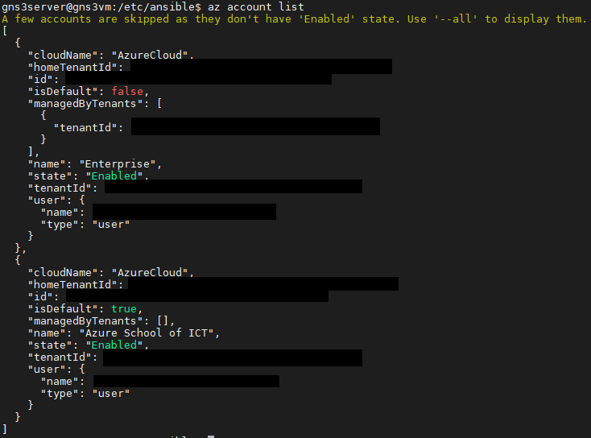

# IN730 Special Topic - Network Automation

## Lab2 - Ansible Playbooks (Cloud Version)

The purpose of this lab is to create more advanced ansible playbooks that will pull information from the GNS3 network as well as configure the GNS3 network which will allow for the routers to have a uniform configuration, at the very end a playbook will be created that will allow for the deployment of virtuals machines in Azure 

In order to achieve this the following will be covered in this lab

- Download and setup an Ubuntu VM
- Download and setup GNS3 on your Windows machine
- Configure a GNS3 router template
- Configure a basic ospf network in GNS3
- Connect GNS3 network to your Ubuntu VM
- Download and configure Ansible on your Ubuntu VM
- Create a Ansible playbook
- Deploy your Ansible playbook against your GNS3 network

## Requirements

- Completion of lab 1
- Azure Subscription
- Terminal Emulator

## Disclaimer

If you stopped your virtual machine that was running your gns3server and you didnt make your tap1 and ip routes persistent then you will need to run the following commands again to recreate those

```
sudo tunctl -t tap1
sudo ifconfig tap1 192.168.1.254 netmask 255.255.255.0 up
sudo ip route add 192.168.1.0/24 via 192.168.1.254 dev tap1
sudo ip route add 192.168.2.0/30 via 192.168.1.254 dev tap1
```

## Ansible playbook to pull device information

We will create an ansible playbook that will pull configuration from our routers that we can use as a backup

In order to achieve this, a directory needs to be created to store the backups of the router’s configuration

This will create a directory in our home directory
```
sudo mkdir ~/ansible-backups
```
Now we will create a playbook called backup.yaml
```
sudo vim /etc/ansible/backup.yaml
```
Insert the following
- Do note, make sure to edit the following 
```
<YOUR HOME DIRECTORY> with the home directory of your user account your using
```

```
---
  - hosts: localhost

    tasks:
            - name: Get Date/Time
              setup:
                      filter: "ansible_date_time"
                      gather_subset: "!all"

            - name: Store Date/Time
              set_fact:
                      DTG: "{{ansible_date_time.date }}"

            - name: Create Directory {{hostvars.localhost.DTG}}
              file:
                      path: /home/<YOUR HOME DIRECTORY>/ansible-backups/{{hostvars.localhost.DTG}}
                      state: directory
    run_once: true

  - hosts: routers
    connection: local
    remote_user: admin
    gather_facts: false
    tasks:
            - name: backup running config
              block:
              - name:
                ios_command:
                  commands: show running-config
                register: config

              - name: save running config to backup folder
                copy:
                  content: "{{config.stdout[0]}}"
                  dest: "/home/<YOUR HOME DIRECTORY>/ansible-backups/{{hostvars.localhost.DTG}}/{{inventory_hostname}}-{{hostvars.localhost.DTG}}-config.txt"
```
You can run your ansible playbooks by being located in the directory where its located by using
```
ansible-playbook backup.yaml
```
Or you can provide the path to the playbook
```
ansible-playbook /etc/ansible/backup.yaml
```
Now that we have pulled the configuration and stored it on our machine lets confirm that it is there

I order to do this we will download and install an application called tree which will help with displaying the contents of our directories
```
sudo apt-get install tree -y
```
We can now use the following command to list the home directory
```
tree ~/ansible-backup
```
you should have an output similar to the following


Here we can see that ansible managed to pull configuration from the routers

## Ansible playbooks to deploy configuration

For this section we will create a playbook that will push configuration to our routers this will allow us to maintain a uniform environment across many devices

```
sudo vim /etc/ansible/motd.yaml
```
Insert the following into our playbook
```
---
  - name: testbook
    hosts: network
    connection: local
    remote_user: admin
    gather_facts: false
    tasks:
            - name: configure login banner
              ios_banner:
                      banner: login
                      text: |
                              Here
                              Is
                              A
                              Test
                              Configuration
                              Banner
                      state: present
```
The purpose of this playbook is to setup a banner so that when we ssh onto our routers we will see it, you can use this banner to warn unauthorized users

You can run your ansible playbooks by being located in the directory where its located by using
```
ansible-playbook motd.yaml
```
Or you can provide the path to the playbook
```
ansible-playbook /etc/ansible/motd.yaml
```

Now let’s connect to our router to see and verify if the change we made took effect

- Do note that due to issues with gns3 and cloud we need to add a few additional options to our ssh command

```
ssh -oKexAlgorithms=+diffie-hellman-group1-sha1 -c 3des-cbc admin@<router IP>
```

We should see the following when we connect


## Create additional VM's using Ansible

In order to create VM's in azure using ansible we need to download and install additional software

We will download curl which we require in order to get the azure command line
```
sudo apt install curl
```

Download and install azure command line
```
curl -sL https://aka.ms/InstallAzureCLIDeb | sudo bash
sudo apt install azure-cli
```

Now that the azure command line has been downloaded and installed, it is time to connect to it
```
az login
```


Follow the on screen prompt and input the code it provides on the website then select your microsoft account that you used for the previous lab

After you have logged in you will be given an output that contains the information about your microsoft azure account



When you use azure cli it will assign anything you create to your default subscription so if you have multiple subscriptions on your account we will need to set this

To change your default subscription is a quick task

```
az account set --subscription <ID>
```

After changing your subscription, you wont be given a notification so you will need to verify that it has changed by using the following command
```
az account list
```

- sudo apt-get install python-pip
- pip install packaging
- pip install msrestazure
- pip install ansible[azure]

We will now create a playbook that will create a virtual machine in azure

```
sudo vim /etc/ansible/create.yaml
```
Insert the following into the playbook
```
---
  - name: Create Azure VM
    hosts: localhost
    connection: local

    vars:
     vm_offer: "UbuntuServer"
     vm_pub: "Canonical"
     vm_sku: "18.04-LTS"

     vm_size: "Standard_E2s_v3"

     az: "australiaeast"
     net: "Ansible"
     vm_net: "AnsibleVNet"
     vm_subnet: "AnsibleSubnet"

     vm_publicIP: "AnsiblePublicIP"
     vm_NSG: "AnsibleNSG"
     vm_NIC: "AnsibleNIC"
     vm_Name: "ansibletest"

     resource_group: "ansible"

     vm_peer: "AnsiblePeer"

     os_user: "ansible"
     os_pass: "ansible@ssw0rd"

    tasks:

    - name: Create virtual network
      azure_rm_virtualnetwork:
        resource_group: "{{ resource_group }}"
        name: "{{ vm_net }}"
        address_prefixes: "10.0.0.0/16"

    - name: Add subnet
      azure_rm_subnet:
        resource_group: "{{ resource_group }}"
        name: "{{ vm_subnet }}"
        address_prefix: "10.0.1.0/24"
        virtual_network: "{{ vm_net }}"

    - name: Create public IP address
      azure_rm_publicipaddress:
        resource_group: "{{ resource_group }}"
        allocation_method: Static
        name: "{{ vm_publicIP }}"
        domain_name: gitlab-test
      register:  reg_publicIP

    - debug: var=reg_publicIP

    - name: Create Network Security Group that allows SSH
      azure_rm_securitygroup:
        resource_group: "{{ resource_group }}"
        name: "{{ vm_NSG }}"
        rules:
          - name: SSH
            protocol: Tcp
            destination_port_range: 22
            access: Allow
            priority: 1001
            direction: Inbound
          - name: HTTP
            protocol: Tcp
            destination_port_range: 80
            access: Allow
            priority: 1002
            direction: Inbound
          - name: HTTPS
            protocol: Tcp
            destination_port_range: 443
            access: Allow
            priority: 1003
            direction: Inbound

    - name: Create virtual network interface card
      azure_rm_networkinterface:
        resource_group: "{{ resource_group }}"
        name: "{{ vm_NIC }}"
        virtual_network: "{{ vm_net }}"
        subnet: "{{ vm_subnet }}"
        public_ip_name: "{{ vm_publicIP }}"
        security_group: "{{ vm_NSG }}"

    - name: Create VM
      azure_rm_virtualmachine:
        resource_group: "{{ resource_group }}"
        name: "{{ vm_Name }}"
        vm_size: "{{ vm_size }}"
        admin_username: "{{ os_user }}"
        admin_password: "{{ os_pass }}"
        ssh_password_enabled: true
        network_interfaces: "{{ vm_NIC }}"
        image:
          offer: "{{ vm_offer }}"
          publisher: "{{ vm_pub }}"
          sku: "{{ vm_sku }}"
          version: latest
```

Now run the playbook

- Do note that it will take roughly 3 minutes to deploy

```
ansible-playbook create.yaml
```

While these virtual machines were created in azure, this same concept can be applied to other cloud vendors as Ansible has modules for a range of cloud providers, the list of modules can be found here https://docs.ansible.com/ansible/2.9/modules/list_of_cloud_modules.html


