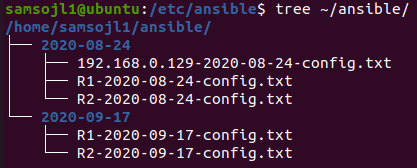

# IN730 Special Topic - Network Automation

## Lab2 - Ansible Playbooks (Local Version)

### Requirements

- VM Workstation 
- Windows Machine
- Completion of lab 1

## Basic Playbooks (pull configs etc?)

## Topology


If you stopped your virtual machine and you didnt make ip routes persistent then you will need to run the following command again to recreate them

```
sudo ip route add 192.168.1.0/30 via 192.168.0.128 dev ens33
```

## Ansible playbook to pull device information

We will create an ansible playbook that will pull configuration from our routers that we can use as a backup

We will need to create a directory to be used to store the backups of the routers configuration

This will create a directory in our home directory
```
sudo mkdir ~/ansible
```
Create a playbook called backup.yaml
```
sudo vim /etc/ansible/backup.yaml
```
Insert the following

Make sure to edit 

```
<YOUR HOME DIRECTORY> with the home directory of your user account your using
```
```
---
  - hosts: localhost

    tasks:
            - name: Get Date/Time
              setup:
                      filter: "ansible_date_time"
                      gather_subset: "!all"

            - name: Store Date/Time
              set_fact:
                      DTG: "{{ansible_date_time.date }}"

            - name: Create Directory {{hostvars.localhost.DTG}}
              file:
                      path: /home/<YOUR HOME DIRECTORY>/ansible/{{hostvars.localhost.DTG}}
                      state: directory
    run_once: true

  - hosts: routers
    connection: local
    remote_user: admin
    gather_facts: false
    tasks:
            - name: backup running config
              block:
              - name:
                ios_command:
                  commands: show running-config
                register: config

              - name: save running config to backup folder
                copy:
                  content: "{{config.stdout[0]}}"
                  dest: "/home/<YOUR HOME DIRECTORY>/ansible/{{hostvars.localhost.DTG}}/{{inventory_hostname}}-{{hostvars.localhost.DTG}}-config.txt"
```


now run the playbook which will run 
```
show running-config
```
and store this 
```
ansible-playbook backup.yaml
```
we will download and install an application called tree which will help with displaying the contents of our directories
```
sudo apt-get install tree
```
we can now use the following command to list the home directory
```
tree ~/ansible/
```
you should have an output simillar to the following



Here we can see that ansible managed to pull configuration from the routers


## Ansible playbooks to deploy configuration

We will create a playbook that will push configuration to our routers this will allow us to maintain a uniform environment

```
---
  - name: testbook
    hosts: network
    connection: local
    remote_user: admin
    gather_facts: false
    tasks:
            - name: configure login banner
              ios_banner:
                      banner: login
                      text: |
                              Here
                              Is
                              A
                              Test
                              Configuration
                              Banner
                      state: present
```

Now lets connect to our router to see the change we made

- Do note that due to issues with gns3 and cloud we need to add a few additional options to our ssh command

```
ssh -oKexAlgorithms=+diffie-hellman-group1-sha1 -c 3des-cbc admin@<router IP>
```

If we now ssh onto the router we can see that ansible has configured a motd banner

## run a check on your config backups to make sure that they are configured the same - the interface ip and such

az login will open a web browser

## Ansible playbooks to deploy configuration

We will create a playbook that will push configuration to our routers this will allow us to maintain a uniform environment

```
---
  - name: testbook
    hosts: network
    connection: local
    remote_user: admin
    gather_facts: false
    tasks:
            - name: configure login banner
              ios_banner:
                      banner: login
                      text: |
                              Here
                              Is
                              A
                              Test
                              Configuration
                              Banner
                      state: present
```

Now lets connect to our router to see the change we made

- Do note that due to issues with gns3 and cloud we need to add a few additional options to our ssh command

```
ssh -oKexAlgorithms=+diffie-hellman-group1-sha1 -c 3des-cbc admin@<router IP>
```

If we now ssh onto the router we can see that ansible has configured a motd banner


## run a check on your config backups to make sure that they are configured the same - except for the interface ip and such


## Create additional VM's using Ansible

In order to create VM's in azure using ansible we need to download and install additional software

We will download curl which we require in order to get the azure command line
```
sudo apt install curl
```

Download and install azure command line
```
curl -sL https://aka.ms/InstallAzureCLIDeb | sudo bash
sudo apt install azure-cli
```

Now that we have downloaded and installed azure command line we need to connect to it
```
az login
```


Follow the on screen prompt and input the code it provides on the website then select your microsoft account that you used for the previous lab

After you have logged in you will be given an output that contains the information about your microsoft azure account


When you use azure cli it will assign anything you create to your default subscription so if you have multiple subscriptions on your account we will need to set this

To change your default subscription is a quick task

```
az account set --subscription <ID>
```

After changing your subscription you wont be given a notification so you will need to verify that it has changed by using the following command
```
az account list
```

- sudo apt-get install python-pip
- pip install packaging
- pip install msrestazure
- pip install ansible[azure]

We can now create a playbook that will create a virtual machine 
```
- name: Create Azure VM
  hosts: localhost
  connection: local

  vars:
   vm_offer: "UbuntuServer"
   vm_pub: "Canonical"
   vm_sku: "18.04-LTS"

   vm_size: "Standard_E2s_v3"

   az: "australiaeast"
   net: "Ansible"
   vm_net: "AnsibleVNet"
   vm_subnet: "AnsibleSubnet"

   vm_publicIP: "AnsiblePublicIP"
   vm_NSG: "AnsibleNSG"
   vm_NIC: "AnsibleNIC"
   vm_Name: "ansibletest"

   resource_group: "ansible"

   vm_peer: "AnsiblePeer"

   os_user: "ansible"
   os_pass: "ansible@ssw0rd"

  tasks:

  - name: Create virtual network
    azure_rm_virtualnetwork:
      resource_group: "{{ resource_group }}"
      name: "{{ vm_net }}"
      address_prefixes: "10.0.0.0/16"

  - name: Add subnet
    azure_rm_subnet:
      resource_group: "{{ resource_group }}"
      name: "{{ vm_subnet }}"
      address_prefix: "10.0.1.0/24"
      virtual_network: "{{ vm_net }}"

  - name: Create public IP address
    azure_rm_publicipaddress:
      resource_group: "{{ resource_group }}"
      allocation_method: Static
      name: "{{ vm_publicIP }}"
      domain_name: gitlab-test
    register:  reg_publicIP

  - debug: var=reg_publicIP

  - name: Create Network Security Group that allows SSH
    azure_rm_securitygroup:
      resource_group: "{{ resource_group }}"
      name: "{{ vm_NSG }}"
      rules:
        - name: SSH
          protocol: Tcp
          destination_port_range: 22
          access: Allow
          priority: 1001
          direction: Inbound
        - name: HTTP
          protocol: Tcp
          destination_port_range: 80
          access: Allow
          priority: 1002
          direction: Inbound
        - name: HTTPS
          protocol: Tcp
          destination_port_range: 443
          access: Allow
          priority: 1003
          direction: Inbound

  - name: Create virtual network interface card
    azure_rm_networkinterface:
      resource_group: "{{ resource_group }}"
      name: "{{ vm_NIC }}"
      virtual_network: "{{ vm_net }}"
      subnet: "{{ vm_subnet }}"
      public_ip_name: "{{ vm_publicIP }}"
      security_group: "{{ vm_NSG }}"

  - name: Create VM
    azure_rm_virtualmachine:
      resource_group: "{{ resource_group }}"
      name: "{{ vm_Name }}"
      vm_size: "{{ vm_size }}"
      admin_username: "{{ os_user }}"
      admin_password: "{{ os_pass }}"
      ssh_password_enabled: true
      network_interfaces: "{{ vm_NIC }}"
      image:
        offer: "{{ vm_offer }}"
        publisher: "{{ vm_pub }}"
        sku: "{{ vm_sku }}"
        version: latest

  - name: Peer Old To New
    azure_rm_virtualnetworkpeering:
      resource_group: "{{ resource_group }}"
      virtual_network: "{{ net }}"
      name: "{{ vm_peer }}"
      remote_virtual_network:
              resource_group: "{{ resource_group }}"
              name: "{{ vm_net }}"
      allow_virtual_network_access: true
      allow_forwarded_traffic: true

  - name: Peer New To Old
    azure_rm_virtualnetworkpeering:
      resource_group: "{{ resource_group }}"
      virtual_network: "{{ vm_net }}"
      name: "{{ net }}"
      remote_virtual_network:
              resource_group: "{{ resource_group }}"
              name: "{{ net }}"
      allow_virtual_network_access: true
      allow_forwarded_traffic: true
```
At the end of this playbook we added the azure_rm_virtualnetworkpeering module, this will allow devices in different networks to communicate with each other