# IN730 Special Topic - Network Automation

## Lab3 - SOMETHING

## Automate Ansible Playbooks

We will expand upon our backup script by automating it so that it will backup our router configs daily so that if we need to revert we can easily

Lets go into cron
```
crontab -e
```
And insert the following at the bottom
```
1 0 1-31 * * ansible-playbook /etc/ansible/backup.yaml
```

Your crontab should look simillar to the image below

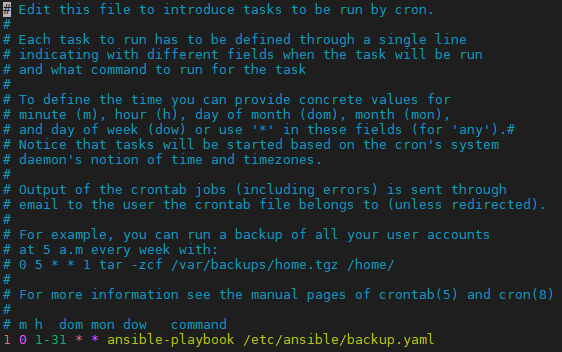

This will run our playbook everyday at 00:01

You can use this same principal in order to run other playbooks that you may wish to automate

## Ansible on physical gear

## Requirements

- VM Workstation 
- Windows Machine
- Completion of lab 1
- 2 Routers
- 1 Switch

This section will combine aspects from Lab 1 and 2 and apply them towards physical equipment

First thing we need to do is download a ubuntu image that we will use to create our linux VM that will be used for as the ansible server

- Download Ubuntu 20.04.1 LTS image from here https://ubuntu.com/download/desktop

After downloading the ubuntu image we will now create a virtual machine in VM Workstation

- Launch the VM Workstation Application 
- Go to File
- Select New Virtual Machine 
- Select the "Typical (recommended)" option 

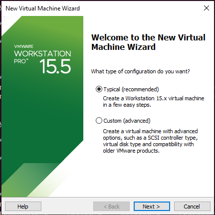

- Select "Installer disc image file (iso):" then locate the Ubuntu iso file you downloaded earlier

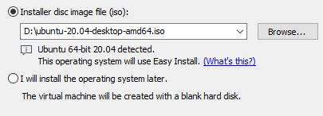

- Personalize your ubuntu machine how you wish

- Leave the "Specify Disk Capacity" with the defaults 

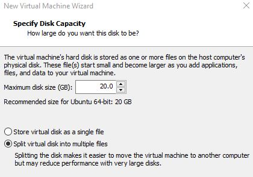

- Customize Hardware and change the RAM to 4GB

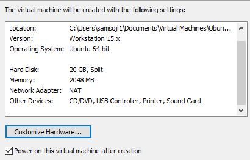

- Finish


After creating the linux VM we now need to configure some network options in VM workstation

- Click on the Edit tab and go click on the virtual network editior 

- Click on the "Change Settings" option and accept the administrator promopt 

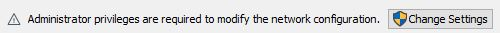

- Select VMnet0 then select Bridged and bridge it to your machines physical network interface

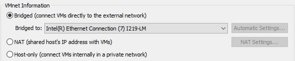

- Also select the VMnet that has the type and external connection of NAT and change its subnet ip to 192.168.0.0 with a subnet mask of 255.255.255.0

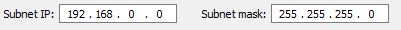

In the end your Virtual Network Editor should look simillar to the image below

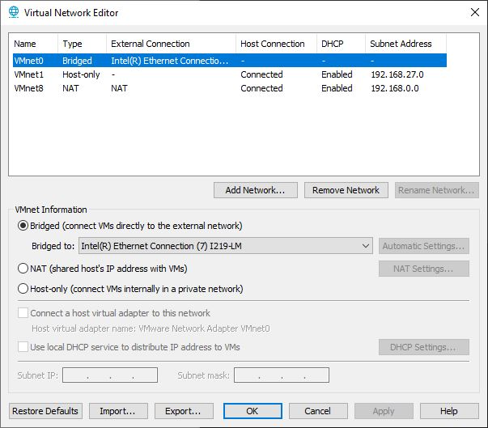


- Connect to your linux VM and open a terminal

- use the command "ip a" and note down the ip address on the ens33(ens number may vary but there will be only one)

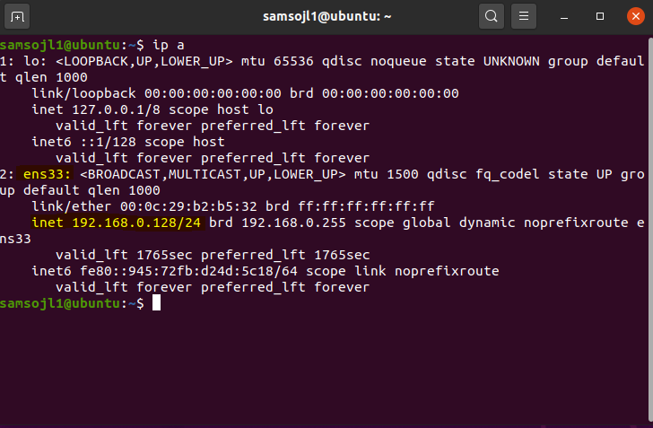

This ip will be used later

Lets create a simple network


## ** REDO THE TOPOLOGY ** instead of the cloud it connects to the pc? actually it wont be physically connected?

- Cable these 2 routers together according to the topology above
- Console onto R1/R2


- SWITCH inbetween R1 and cloud?

On R1
```
end
conf t
int g0/1
ip address 192.168.1.1 255.255.255.252
no shut
```
On R2
```
end
conf t
int g0/1
ip address 192.168.1.2 255.255.255.252
no shut
```
Verify that R1 can ping R2 and R2 can ping R1

## On the interface you connected your R1 to the cloud you need to configure it with an ip in the same range as the physical interface, the ens33 ip you recorded earlier

On R1 
```
end
conf t
int g0/2
ip address 192.168.0.1 255.255.255.0
no shut
```

Configure OSPF and a static default route then redistirbute that route into ospf

On R1
```
end
conf t
ip route 0.0.0.0 0.0.0.0 192.168.0.128
router ospf 1
router-id 1.1.1.1
network 192.168.0.0 0.0.0.255 area 0
network 192.168.1.0 0.0.0.3 area 0
default-information originate
```

On R2
```
end
conf t
router ospf 1
router-id 2.2.2.2
network 192.168.1.0 network 0.0.0.3 area 0
```

Because ansible is agentless and uses SSH to deploy playbooks, you will need to configure and enable SSH onto your GNS3 Routers, a basic configuration has been provided 

``` 
end
conf t
ip domain-name ansible.com
crypto key generate rsa general-keys modulus 1024
ip ssh version 2
username admin privilege 15 password 0 admin
line vty 0 4
login local
transport input ssh
exit
```

On your linux vm you will need to configure a route so that traffic knows where to go to to get to your GNS3 routers

In your linux terminal use the following command

```
sudo ip route add 192.168.0.0/24 via 192.168.0.128 dev ens33
sudo ip route add 192.168.1.0/30 via 192.168.0.128 dev ens33
```

Do note that routes configured this way aren't persistent and will need to be re entered, you can configure them to be persistent but for what we are trying to do that isn't required

Before we switch ports on our machine and lose internet connection lets first install some software that we will need

```
sudo apt-get update
sudo apt-get install -y ansible
sudo apt-get install -y tree
sudo apt-get install -y net-tools
sudo apt-get install -y vim
```


- Control Panel
- Network and Sharing Center
- Change adapter settings
- Right click Ethernet 6 -> properties
- Accept
- Internet Protocol Version 4 -> properties
- use the following ip address 

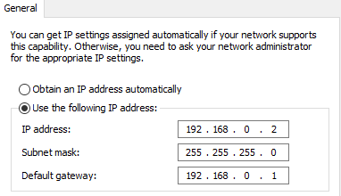

- ok
- ok

Now we can change from the L port to the T port so that your machine is now plugged into R1


1) On the Start menu, Click ‘Windows Firewall with Advanced Security’.

How to Add IP Address in Windows Firewall

 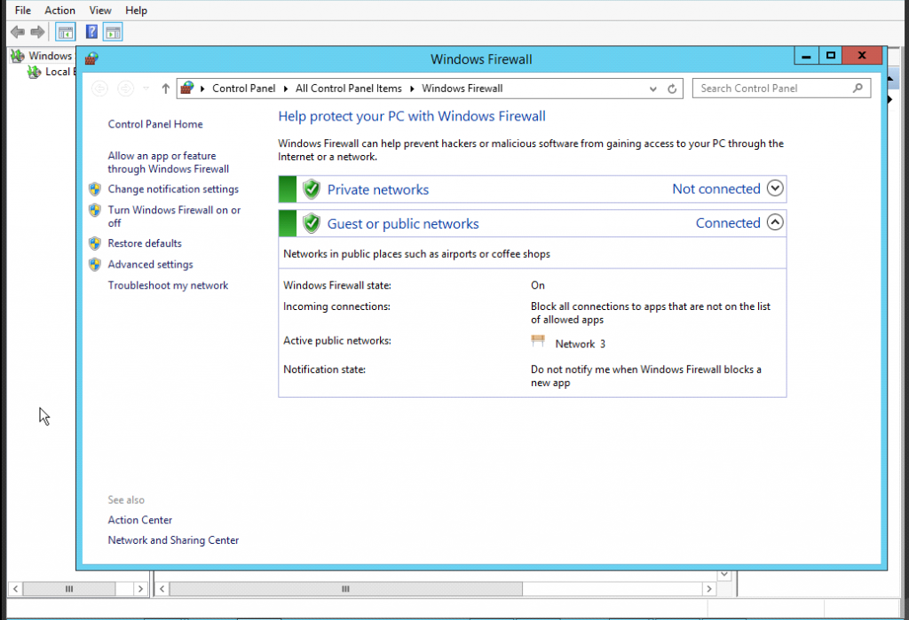

2) Click the ‘Advanced settings’ option in the sidebar.

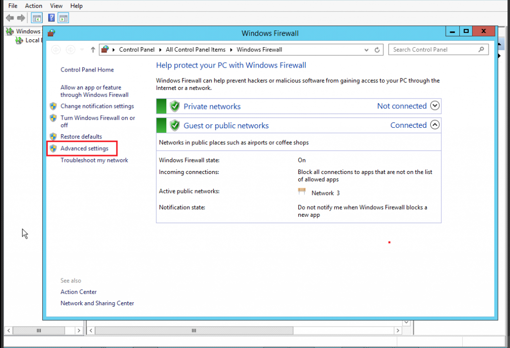 

3) On the left side, click the option ‘Inbound Rules’.

How to Add IP Address in Windows Firewall

 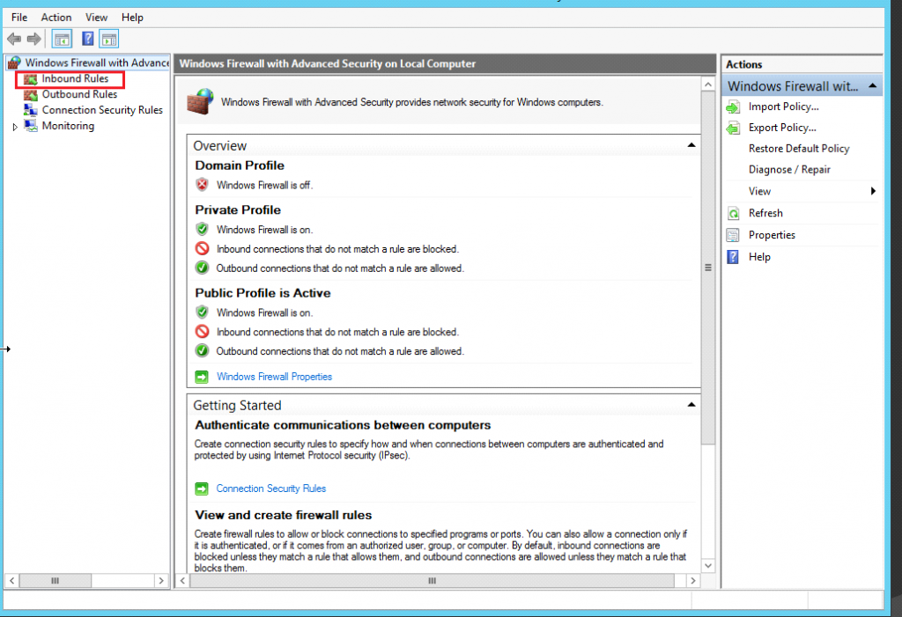 

4) On the right, under the section ‘Actions’, click on the option ‘New Rule’. Windows Firewall shows you the New Inbound Rule Wizard.

 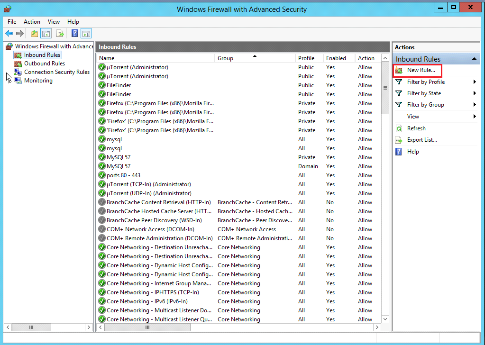 

5) A new window will open and Select the ‘custom’ option and click Next.

How to Add IP Address in Windows Firewall

 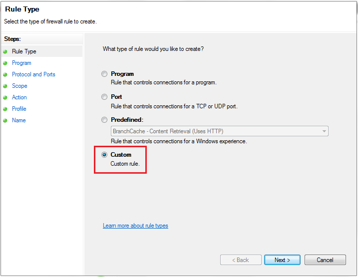 

6) In the left-hand side again, go to the option ‘Scope’.

How to Add IP Address in Windows Firewall

 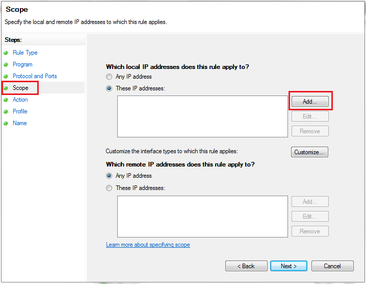 

7) Add the IP address and click on the ‘Ok’ button.

How to Add IP Address in Windows Firewall

 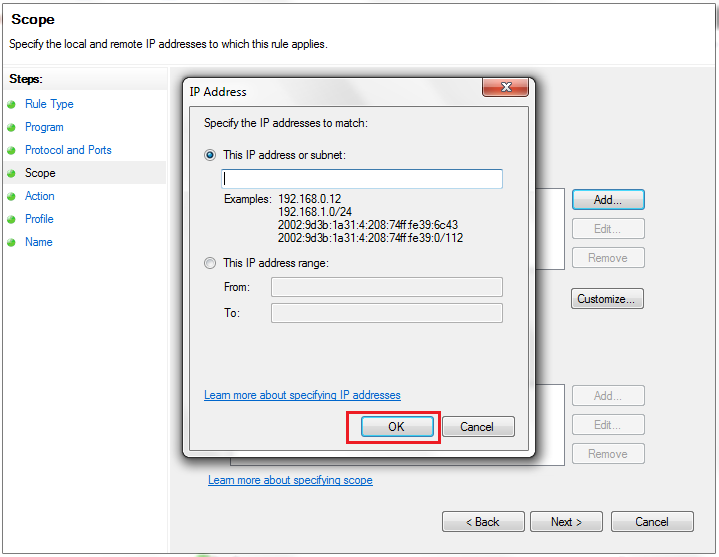 

That is how you add an IP address to the windows firewall.

## create a network with a playbook? (AZURE?)
