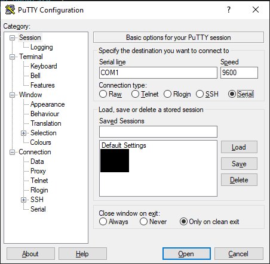

# IN730 Special Topic - Network Automation

## Lab3 

## Ansible on physical gear

## Requirements

- VM Workstation 
- Windows Machine
- Completion of lab 1 and 2
- 2 Routers
- 1 Switch

This section will combine aspects from Lab 1 and 2 and apply them towards physical equipment

## Ubuntu VM Setup

First thing we need to do is download a ubuntu image that we will use to create our linux VM that will be used for as the ansible server

- Download Ubuntu 20.04.1 LTS image from here https://ubuntu.com/download/desktop

After downloading the ubuntu image we will now create a virtual machine in VM Workstation

- Launch the VM Workstation Application 
- Go to File
- Select New Virtual Machine 
- Select the "Typical (recommended)" option 


- Select "Installer disc image file (iso):" then locate the Ubuntu iso file you downloaded earlier


- Personalize your ubuntu machine how you wish

- Leave the "Specify Disk Capacity" with the defaults 


- Select "Customize Hardware"
- Change the RAM to 4GB


- Finish

## VM Workstation Virtual Network Editor

After creating the linux VM we now need to configure some network options in VM workstation's virtual network editor which will bridge our physical network with our virtual network allowing our linux vm to reach our phyiscal routers

- Click on the Edit tab and go click on the virtual network editior 

- Click on the "Change Settings" option and accept the administrator promopt 


- Select VMnet0 then select Bridged and bridge it to your machines physical network interface


- Also select the VMnet that has the type and external connection of NAT and change its subnet ip to 192.168.0.0 with a subnet mask of 255.255.255.0


In the end your Virtual Network Editor should look simillar to the image below


- Connect to your linux VM and open a terminal

- Use the command

```
ip a
```

And note down the ip address of the interface ens33


## Create a simple network

Lets cable and create a simple network


- Cable 2 routers together according to the topology above
- Cable R1 and the PC into the switch according to the topology

Console onto the routers so that you can configure them

- Open your prefered terminal emulator
- Select serial for the "Connection type"
- Open the connection



Now configure the interfaces between R1 and R2

On R1
```
end
conf t
int g0/1
ip address 192.168.1.1 255.255.255.252
no shut
```
On R2
```
end
conf t
int g0/1
ip address 192.168.1.2 255.255.255.252
no shut
```
Verify that R1 can ping R2 and R2 can ping R1

Now configure to configure the interface that is connected to the switch

On R1 
```
end
conf t
int g0/2
ip address 192.168.0.1 255.255.255.0
no shut
```

Configure a static default route and OSPF then redistirbute the static route into OSPF

On R1
```
end
conf t
ip route 0.0.0.0 0.0.0.0 192.168.0.128
router ospf 1
router-id 1.1.1.1
network 192.168.0.0 0.0.0.255 area 0
network 192.168.1.0 0.0.0.3 area 0
default-information originate
```

On R2
```
end
conf t
router ospf 1
router-id 2.2.2.2
network 192.168.1.0 network 0.0.0.3 area 0
```

Now change the default hostnames on Router1 and Router2, this is because when we create the crypto keys in the next step they require that the hostname be a different one from the default

On R1
```
end
conf t
hostname R1
```

On R2
```
end
conf t
hostname R2
```
Because Ansible is agentless and uses SSH to deploy playbooks, SSH will need to be configured and enabled on the routers, a basic configuration for this has been provided 

``` 
end
conf t
ip domain-name ansible.com
crypto key generate rsa general-keys modulus 1024
ip ssh version 2
username admin privilege 15 password 0 admin
line vty 0 4
login local
transport input ssh
exit
```

## Linux Routing

On the linux vm you will need to configure a route so that traffic knows where to go to to get to the routers

Open a linux terminal and use the following commands

```
sudo ip route add 192.168.0.0/24 via 192.168.0.128 dev ens33
sudo ip route add 192.168.1.0/30 via 192.168.0.128 dev ens33
```

- Do note that routes configured this way aren't persistent and will need to be re entered, you can configure them to be persistent but for what this lab is trying to achieve this isn't required

## Software

Before switching from the Live (L) to Test (T) port on our machine and therefor lose internet connection lets first download and install some software that we will need

```
sudo apt-get update
sudo apt-get install -y ansible
sudo apt-get install -y tree
sudo apt-get install -y net-tools
sudo apt-get install -y vim
```

## Local Network Settings

Now to change the ip address of the interface that we are using on our windows machine 


- Open Control Panel
- Navigate to Network and Sharing Center
- Select Change adapter settings
- Right click Ethernet 6 -> properties


- Select Internet Protocol Version 4 (TCP/IPv4)
- Open Properties


- Select "Use the following IP address"

Use the following settings 

- IP Address: 192.168.0.2
- Subnet Mask: 255.255.255.0
- Default Gateway: 192.168.0.1


- Click "Ok" to confirm the settings
- Click "Ok" to exit

Now you can change from the L port to the T port this will then connect your windows machine to R1

## Firewall


Normally when working in the network room you would launch a windows VM that we would then turn the firewall off to allow pings and connection from the routers to the machine

In order for our routers to be able to ping our windows device we need to create a firewall rule

Here is a guide on how to Add IP Address in Windows Firewall

- On the Start menu, Click ‘Windows Firewall with Advanced Security’.


- Click the ‘Advanced settings’ option in the sidebar.

 

- On the left side, click the option ‘Inbound Rules’.

 

- On the right, under the section ‘Actions’, click on the option ‘New Rule’. Windows Firewall shows you the New Inbound Rule Wizard.

 

- A new window will open and Select the ‘custom’ option and click Next.

 

- In the left-hand side again, go to the option ‘Scope’.

 

- Add the IP address and click on the ‘Ok’ button.

 

- add 192.168.1.0/30
- add 192.168.0.0/24

Now that the firewall has been configured 

## Ansible Hosts

First disable host_key_checking in the ansible.cfg file so that you don't need to SSH onto the routers first before we can deploy playbooks, while this helps to save time in a lab environment it is also a security risk

```
sudo vim /etc/ansible/ansible.cfg
```
Go to line 62 and uncomment the following
```
#host_key_checking = False
```
Then save the file

```
[routers]
R2 ansible_host=192.168.1.1 ansible_network_os=ios ansible_ssh_user=admin ansible_ssh_pass=admin
R1 ansible_host=192.168.1.2 ansible_network_os=ios ansible_ssh_user=admin ansible_ssh_pass=admin
```

## Ansible Playbooks

We will run 2 playbooks against our physical routers

The ping playbook which we created in Lab1 and the backup playbook which was created in Lab2

The configuration for those playbooks has been provided below

### Ping

```
sudo vim /etc/ansible/ping.yaml
```

And insert the following
```
---
  - name: ping
    hosts: routers
    connection: local
    gather_facts: false
    tasks:
            - ping:
```

### Backup

Create the directory that you will use to store the backup files
```
sudo mkdir ~/ansible
```
Create a playbook called backup.yaml
```
sudo vim /etc/ansible/backup.yaml
```

Insert the following

- Do note, make sure to edit the following 
```
<YOUR HOME DIRECTORY> with the home directory of your user account your using
```
```
---
  - hosts: localhost

    tasks:
            - name: Get Date/Time
              setup:
                      filter: "ansible_date_time"
                      gather_subset: "!all"

            - name: Store Date/Time
              set_fact:
                      DTG: "{{ansible_date_time.date }}"

            - name: Create Directory {{hostvars.localhost.DTG}}
              file:
                      path: /home/<YOUR HOME DIRECTORY>/ansible/{{hostvars.localhost.DTG}}
                      state: directory
    run_once: true

  - hosts: routers
    connection: local
    remote_user: admin
    gather_facts: false
    tasks:
            - name: backup running config
              block:
              - name:
                ios_command:
                  commands: show running-config
                register: config

              - name: save running config to backup folder
                copy:
                  content: "{{config.stdout[0]}}"
                  dest: "/home/<YOUR HOME DIRECTORY>/ansible/{{hostvars.localhost.DTG}}/{{inventory_hostname}}-{{hostvars.localhost.DTG}}-config.txt"
```

Now that both of the playbooks have been created, they should be ran in order to confirm that everything is working correctly

```
cd /etc/ansible
ansible-playbook ping.yaml
```
```
cd /etc/ansible
ansible-playbook backup.yaml
```

- If you get a permssion error when running the backup.yaml playbook you may need to change the permissions on your backup directory

```
sudo chmod 777 /home/<YOUR HOME DIRECTORY>/ansible/
```

## Automate Ansible Playbooks

Now to expand upon the backup script by automating it so that it will backup the router configs daily

Cron will be the what is used in order to have the playbooks deployed automatically

Open up cron using the following command

```
crontab -e
```

And insert the following at the bottom of the file
```
1 0 1-31 * * ansible-playbook /etc/ansible/backup.yaml
```

Your crontab should look simillar to the image below


This will run our playbook everyday at 00:01

You can use this same principal in order to run other playbooks that you may wish to automate
